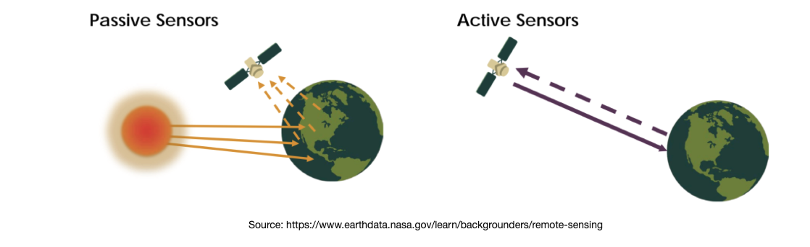
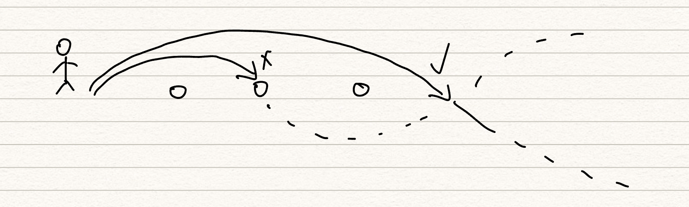

class: inverse, middle

# Summary of sensor types

## Optical | Passive
## Synthetic Aperture Radar (SAR) | Active
### Capella Space focused on SAR satellites servies.


---

class: inverse, center, middle

# Passive vs. Active


### There a two way for satellite to collect information: passively and actively. As the name suggested, the difference between two kinds of sensor is the source of radiance. It's like hearing echo from Earth on a satellite, but who play the music would be different. 

```{r echo=FALSE, out.width='100%', fig.align='center'}



```


---
# Brief introduction

## Capella Space

Capella Space is the first U.S. company providing commercial SAR satellite since 2018. As a company in space industry, they provide service including disaster response, resource detection, and national security.

## The Acadia Satellites
The first Acadia Satellite was launched in 2023. Comparing to previous satellite sensors, the Acadia series have better image quality and faster response time.
Each satellite carries an X-band radar, and they are able to collect SAR interferometry data. 

(Farquharson et al., 2023)

---
class: middle
## The Acadia Satellites
Each Capella's satellite equipped with X-band sensor, it collects high resolution data for urban monitoring, vegetation cover, etc.

Some parameter of the sensor is shown:

- Radar bandwidth: 10-700 MHz
- Slant Range Resolution: 0.214 m
- Ground Range Resolution: 0.26 - 0.76 m
- Look angle range: 15 - 50 degree


(Farquharson et al., 2023)


---
class: middle
# The application of SAR satellites

As Acadias are SAR satellites, they would be applied in remote sensing detection, such as hydrological data collection (Musa, et al., 2015).

The SAR satellite could be used in archaeology, finding "lost city" (Lem, 2017). Thanks to the long wavelength in SAR, they are able to penetrate earth surface and discover what is hidden.

---
class: middle
# The application of SAR satellites

The X-band SAR sensor could be also applied on forest border line detection (Perko, 2011).
Another advantage of remotely sensing is that it could gather earch surface data in a long term. Therefore, it is able to detect subtle changes within building structure. For instance, Lazecky et al. (2016) suggested that long time series SAR images could be used to detect the impact of seasonal effects on bridges. 


---

# Reflection

### Wavelenth

I'm curious about how the sensors could detect the earth surface, and here are my understanding. Wavelenth is an important feature of SAR as it represent how the signal is interacting with the target. The reason that longer wavelenth could penetrate more layers is that it has lower chance to hit particles and being scattered. Imaging you jump over some obstacle such as rocks, if you can jump farther, the stone won't trip you.


```{r echo=FALSE, out.width='100%', fig.align='center'}

```


---
class: middle
# Reflection

In terms of the Capella's satellites, X-band is powerful for their operation. However, there are sensors with longer wavelength, such as C-band (3.8-7.5cm), S-band (7.5-15cm), and P-band (30-100cm). These sensors could achieve greater penetration depth and uncover more information. 

### InSAR

The SAR could collect interferometry data which can provide distance and additional geometric information of the target. This is able to detect earthquake fault slip on the earth surface. 


---

# Reference

Capella Space https://support.capellaspace.com/hc/en-us/articles/360059209731-What-types-of-sensors-do-Capella-s-satellites-use-

Farquharson, G., Castelletti, D., De, S., Stringham, C., Yague, N., Bes, V.C., Ryu, J. and Goncharenko, Y., 2023, July. The New Capella Space Satellite Generation: Acadia. In IGARSS 2023-2023 IEEE International Geoscience and Remote Sensing Symposium (pp. 1513-1516). IEEE.

Lazecky, M., Hlavacova, I., Bakon, M., Sousa, J.J., Perissin, D. and Patricio, G., 2016. Bridge displacements monitoring using space-borne X-band SAR interferometry. IEEE Journal of Selected Topics in Applied Earth Observations and Remote Sensing, 10(1), pp.205-210.

Lem, P. (2017) Peering through the sands of time: Searching for the origins of space archaeology, NASA. Available at: https://earthobservatory.nasa.gov/features/SpaceArchaeology (Accessed: 13 February 2024). 


---
# Reference

Musa, Z.N., Popescu, I. and Mynett, A., 2015. A review of applications of satellite SAR, optical, altimetry and DEM data for surface water modelling, mapping and parameter estimation. Hydrology and Earth System Sciences, 19(9), pp.3755-3769.

Perko, R., Raggam, H., Deutscher, J., Gutjahr, K. and Schardt, M., 2011. Forest assessment using high resolution SAR data in X-band. Remote sensing, 3(4), pp.792-815.


